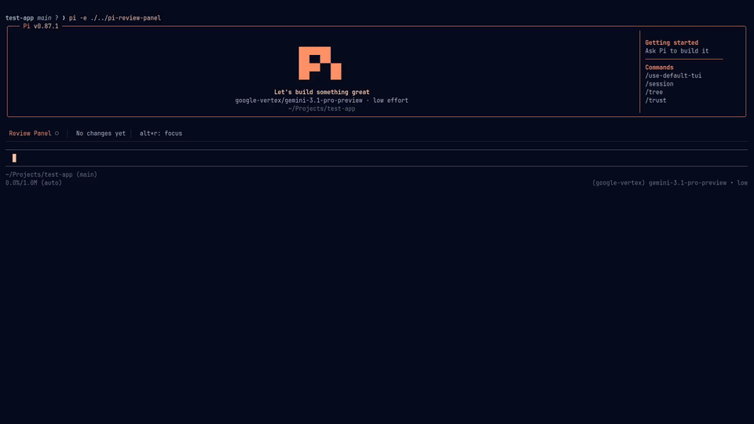

<div align="center">


[](https://x.com/knowpradhumna)
[](https://www.gnu.org/licenses/gpl-3.0)
[](https://github.com/pnpancholi/pi-review-panel/commits/main)
</div>

A session-aware review panel for the [pi coding agent](https://pi.dev). See exactly which files the agent changed during your session and navigate the diffs — before you commit.

<div align="center">

</div>

## Installation

```bash
pi install npm:@pnpancholi/pi-review-panel
```

## Usage

- Run `/review` inside a pi session to toggle the review panel. It opens by default when you start a session.

- Press `Alt+r` to toggle focus between the editor and the review panel.

**Panel navigation**

| Key | Action |
| --- | --- |
| `↑` / `↓` or `k` / `j` | Move through the file list |
| `Enter` | Open diff for selected file |
| `Esc` | Deactivate panel |

**Diff view**

| Key | Action |
| --- | --- |
| `↑` / `↓` or `k` / `j` | Scroll vertically |
| `Page Up` / `Page Down` | Scroll by page |
| `←` / `→` or `h` / `l` | Scroll horizontally |
| `Esc` | Close diff, return to panel |

## Features

- **Review panel** — see every file changed during the current session in one place
- **Session-aware tracking** — changes are tied to your session ID, so you can resume or start fresh without conflicts
- **`/review` command** — toggle the panel open or closed from anywhere in your session
- **Side-by-side diff view** — clean before/after comparison with add/remove markers and line numbers
- **Theme-aware syntax highlighting** — code highlights match your terminal theme
- **Nerd Font support** — file-type icons for a better visual experience, with a built-in installer if you don't have one
- **Vim keybindings** — navigate with `j`/`k`, `h`/`l`, and other familiar vim motions, in addition to arrow keys

## Scenarios

- **Co-working sessions (same branch, different session)** — running multiple sessions on the same branch, each focused on a different part of the codebase. One session handles components like `button.tsx` and `toast.tsx`, another handles API routes. The review panel keeps each session's changes isolated, so you can thoroughly review what each agent did without cross-contamination. Cognitive focus matters when shipping with LLM velocity.

- **Agentic engineering with thorough review (one session, thoroughly reviewed)** — one session, one task, every line reviewed. Whether you're a new dev or a seasoned one, if your workflow demands careful human oversight of every change an agent makes, the session-aware review panel gives you a clean, focused view of exactly what changed — no noise, no distractions.

- **Agent maxxing (multiple sessions, multiple branches via worktrees)** — multiple sessions across branches via worktrees. You're mid-feature when a hotfix lands, and you still need to finish docs. With [herdr](https://herdr.dev) or similar, you spin up parallel sessions across branches. The review panel keeps each branch's changes scoped to its session, so you can context-switch without losing track of what changed where.

## Caveats

- **Tool-call tracking only** — the review panel captures changes made through pi's `write` and `edit` tool calls. Manual edits (e.g., opening a file in your editor, creating a file or directory via bash) won't appear in the panel. This is intentional — it keeps each session's changes isolated, so you can switch between sessions without cross-contamination.

## Roadmap

- **`/diff <filename>` (inspired by [OpenCode](https://opencode.ai))** — jump directly to a file's diff without scrolling through the full list. For example, `/diff button.tsx` opens a full-screen diff view of that file. If the file hasn't been changed, you'll get a clear notification instead of an empty pane.

## Support

- **Bug reports** — [open an issue](https://github.com/pnpancholi/pi-review-panel/issues)
- **Questions** — [open a discussion](https://github.com/pnpancholi/pi-review-panel/discussions) or reach out on [X/Twitter](https://x.com/knowpradhumna)

